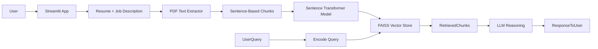

## 🧭 System Flow Diagram (Mermaid)

```mermaid
flowchart LR
    User --> UI[Streamlit App]
    UI --> Uploads[Resume + Job Description]
    Uploads --> Extract[PDF Text Extractor]
    Extract --> Chunking[Sentence-Based Chunks]
    Chunking --> Embeddings[Sentence Transformer Model]
    Embeddings --> FAISSIndex[FAISS Vector Store]
    UserQuery --> EmbeddingQuery[Encode Query]
    EmbeddingQuery --> FAISSIndex
    FAISSIndex --> RetrievedChunks
    RetrievedChunks --> OpenAI[LLM Reasoning]
    OpenAI --> ResponseToUser
```
